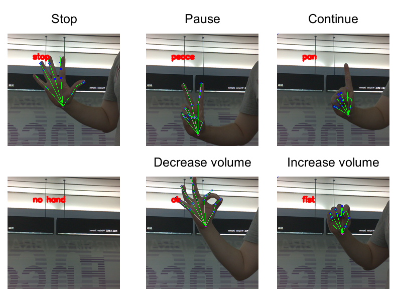

# Speech Robot
This project is a Speech Robot based on Google ASR model and GTTS(Google Text-To-Speech) deployed on jetson nano 2GB. User order the jetson nano by oral or hand pose commend and the jetson nano will output corresponding information. We provide four services. Such as <br>
* Chatting
* Weather searching
* Time searching
* Playing YT music

## Hardware requirement
1. [jetson nano](https://www.nvidia.com/zh-tw/autonomous-machines/embedded-systems/jetson-nano/)
2. Speaker
3. Mic 
4. [Raspberry Pi camera v2](https://www.raspberrypi.com/products/camera-module-v2/)
5. Cable to connect above devices.

## Used Technology and Result Demo


### Controlling music playing by hand pose
During the music playback, we use hand pose to control the playing, for the voice of music might interference detection of oral commend. We use the [trt_pose_hand](https://github.com/NVIDIA-AI-IOT/trt_pose_hand) as our hand pose estimation and classification model. There are totally six different gestures (pan, peace, ok, fist, stop and no hand) and corresponding five operations for controlling the playing of current music. 

Six kinds of gesture map five operation.<br>
1. "stop" will terminate the playing.
2. "peace" will Pause the playing.
3. "pan" will continue the playing.
4. "fist" will increase the volume of music.
5. "ok" will decrease the volume of music.
6. "no hand" will do nothing.

Remark: Please make sure your hand is <font color='red'>enough far away and in the middle</font> of scene.

## Search weather
We provide a weather searching function in our chat robot. Using keyword "天氣" or "weather" to activate this service. After service activated success, robot will ask where does the user want to search the weather. Choose and speak the desire city name, robot will search and answer you. We use beautifulsoup4 and requests to do the web crawlering. The default target website is [新浪天氣](https://weather.sina.com.tw/tw_today.shtml).

<center></center>


## How to use
### 

### Hand Pose Estimation and Classification
IMPORTANT: Everything about the hand pose os in the "trt_pose_hand" directory.<br>
 Our model is from [trt_pose_hand](https://github.com/NVIDIA-AI-IOT/trt_pose_hand). Please follow it's "Getting Started" tutorial to install [trt_pose](https://github.com/NVIDIA-AI-IOT/trt_pose). (torch2trt is not needed). Then, using below commend to install needed python package.
```sh
pip install -r requirement_workstation.txt
```
Run the ```hand_pose_server_ws.py``` and ```server_send_gesture.py``` respectively on your server or any device with defined ID. The first server is for receiving image from jetson nano and do the hand pose algorithm. The second one is for handling request from speech robot. Don't forget change the IP and port of socket into your own IP and desired port number. And you also need to 
```sh
python3 hand_pose_server_ws.py
python3 server_send_gesture.py
```
Then, run photo taking process on jetson nano with camera.
```sh
python3 client.py
```